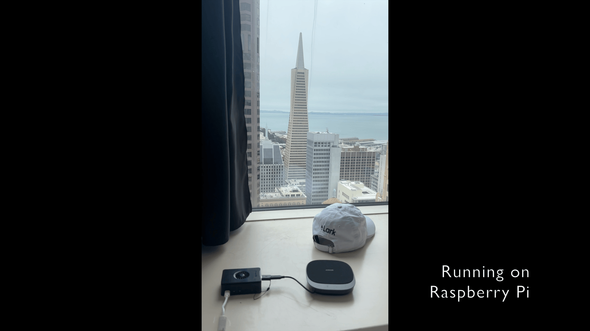

# openlily

openlily is an Alexa-like personal voice assistant. You talk to it
through your own mic and speakers — voice in → LLM → voice out — and it can answer
questions, explain things, and take actions through tools (web search, browser
automation, email, etc). It runs as a terminal voice CLI on your machine, with an
optional wake word so it sits quietly until you call it.

It's built to be **yours**: swap the underlying models (LLM, speech-to-text,
text-to-speech), pick a provider you trust, and turn on only the tools you want.

You can also run it on other standalone devices like raspberry pi, mac mini, etc.

## Demo

**[Watch the demo video](https://youtu.be/Zp6WIQz0-O8?si=HrzU2_j3UUC7hNmV)** to see openlily in action.

<!-- TODO: replace docs/demo.gif with your GIF file (and update the link above). -->


## Features

- **Local voice CLI** — your mic and speakers are the client; no browser or phone
  required. A standalone WebRTC Audio Processing Module (AEC + noise suppression +
  AGC) keeps the bot from hearing itself.
- **Swappable "brains"** — run a cascade pipeline (separate STT → LLM → TTS) or a
  realtime speech-to-speech model, and choose the provider/model for each piece.
- **Wake word** — an optional always-on, on-device listener (openWakeWord) that
  starts a session only when it hears the wake phrase. No cloud, no API key.
- **On-device turn-taking** — Silero VAD + Smart Turn v3 run locally to decide
  when you've started and stopped talking.
- **Tools** — web search, real browser automation, and email, each opt-in. You can write custom tools easily.
- **Usable as a library** — the same brains, tools, and audio cues ship as an
  installable `openlily` package you can drop into your own Pipecat agent and deploy
  to Pipecat Cloud. See [Use it as a library](#use-it-as-a-library).

## Setup

1. **Go to the server directory**:

   ```bash
   cd server
   ```

2. **Install dependencies**:

   ```bash
   uv sync
   ```

   The local-audio path needs PortAudio for PyAudio. Install it for your OS:

   - **macOS** (Homebrew):

     ```bash
     brew install portaudio
     ```

   - **Linux / Raspberry Pi** (Debian, Ubuntu, Raspberry Pi OS):

     ```bash
     sudo apt update
     sudo apt install portaudio19-dev libportaudio2
     ```

     On a Raspberry Pi, also make sure your mic and speakers are recognized
     (`arecord -l` and `aplay -l` should list them). A USB mic/speaker or a USB
     audio interface is the simplest setup; pick the right input/output device
     in your ALSA/PulseAudio config if you have more than one.

     On Linux the wake-word stack pulls in `tflite-runtime`, which only ships
     wheels for Python 3.11. The repo pins that version in `.python-version`, so
     `uv sync` will use it automatically — install it once with
     `uv python install 3.11` if you don't have it. (macOS doesn't need
     `tflite-runtime`, so it isn't affected.)

   The browser tool (if you enable it) launches the Playwright MCP server via
   `npx`, so it needs Node.js. On macOS: `brew install node`. On Linux /
   Raspberry Pi: `sudo apt install nodejs npm` (or install a current release
   from [NodeSource](https://github.com/nodesource/distributions) if your
   distro's packages are old).

3. **Configure environment variables**:

   ```bash
   cp .env.example .env
   ```

   The fastest path to a working assistant — pick one:

   - **As-is (default `cartesia_openai` brain):** set `OPENAI_API_KEY` and
     `CARTESIA_API_KEY`. That's it. Get a Cartesia key at
     [cartesia.ai](https://www.cartesia.ai/).
   - **OpenAI key only, no Cartesia:** switch `default_brain` to `openai_realtime`
     in `brains.yaml` (see below) and set just `OPENAI_API_KEY`. You'll have voice
     in and out, just no web search.
   - **OpenAI key only, with web search:** use `openai_standard` instead — it runs
     entirely on OpenAI (including built-in web search) with only `OPENAI_API_KEY`.
   - **No API keys at all (fully local):** switch `default_brain` to
     `local_whisper_ollama_kokoro` and run a local [Ollama](https://ollama.com/)
     server. Everything (STT, LLM, TTS) runs on your machine — see
     [Run it fully local](#run-it-fully-local-no-api-keys).

   Everything else in `.env` is optional and grouped by when you need it. See
   [Personalizing your assistant](#personalizing-your-assistant) for the full menu.

4. **Run it**:

   ```bash
   uv run bot.py                              # default: wake-word gated local session
   uv run bot.py --mode local                 # mic/speakers voice CLI, no wake word
   uv run bot.py --mode webrtc                # browser debug UI at localhost:7860
   ```

   The first run takes longer to start — usually several seconds, and up to a
   minute — while Python compiles dependencies and the on-device wake-word/VAD
   models download once. The terminal prints a "loading modules" line right away
   so you know it isn't stuck; later runs start in a few seconds.

## Personalizing your assistant

openlily is meant to be configured to your needs. Three knobs:

### 1. Choose the models and providers (the "brain")

A *brain* decides which models do speech-to-text, language, and text-to-speech.
Select one with `default_brain` in `brains.yaml` (copy `brains.yaml.example`;
without the file the default is `cartesia_openai`):

| Brain | STT | LLM | TTS |
| --- | --- | --- | --- |
| `openai_standard` | OpenAI | OpenAI | OpenAI |
| `cartesia_openai` (default) | Cartesia (ink-2) | OpenAI | Cartesia (sonic-3.5) |
| `openai_realtime` | — | OpenAI Realtime (GPT speech-to-speech: STT + LLM + TTS in one) | — |
| `local_whisper_ollama_kokoro` | MLX Whisper (local) | Ollama (local) | Kokoro (local) |

Which to pick:

- **`cartesia_openai` (default)** — the most effective overall: intelligent OpenAI
  LLM paired with Cartesia's strong speech-to-text and smooth, natural TTS. The
  default LLM is `gpt-5.4-mini`; bump it to a more capable model like `gpt-5.5` in
  `brains.yaml` for higher intelligence at the cost of slower replies.
- **`openai_standard`** — the easiest to set up: a single OpenAI API key gets you
  everything (STT, LLM, TTS), no second provider.
- **`openai_realtime`** — feels the fastest, since there's no separate STT/TTS
  stage, but the speech-to-speech model can be less capable than the latest
  non-realtime OpenAI models.
- **`local_whisper_ollama_kokoro`** — fully on-device and free of API keys: MLX
  Whisper for STT, [Ollama](https://ollama.com/) for the LLM, and Kokoro for TTS.
  Best for privacy or offline use; quality and speed depend on your hardware, and
  it has no web search. Requires Apple Silicon (MLX), a running Ollama server, and
  the optional `local-models` dependency extra (`uv sync --extra local-models`) —
  see [Run it fully local](#run-it-fully-local-no-api-keys).

In the same `brains.yaml` you can override each brain's model names and the TTS
voice without touching code — e.g. point the LLM at a different model, or change
the Cartesia voice ID. Want a provider that isn't listed (a different STT/TTS
vendor, a local LLM)? Adding a brain is a small, self-contained change — see
[CONTRIBUTING.md](CONTRIBUTING.md).

#### Run it fully local (no API keys)

The `local_whisper_ollama_kokoro` brain runs the whole pipeline on your machine,
so no provider API keys are needed. It currently requires **Apple Silicon** (the
STT uses MLX Whisper).

> **The on-device model runtimes are an optional extra.** They're heavy —
> `mlx-whisper` pulls in torch (and, on Linux, the whole `nvidia-*` CUDA stack)
> — so they're **not** installed by default. If you only use cloud brains you
> never download them. To use this brain, install the `local-models` extra:
>
> ```bash
> uv sync --extra local-models        # or: pip install '.[local-models]'
> ```
>
> Selecting this brain without the extra fails fast with a message telling you to
> run the command above.

1. **Install the local-model dependencies** (see the note above):

   ```bash
   uv sync --extra local-models
   ```

2. **Install and start [Ollama](https://ollama.com/)**, then pull the LLM:

   ```bash
   ollama pull gemma4:e4b        # or gemma4:e2b for a lighter/faster model
   ```

   Make sure the server is running and reachable before you start the bot —
   `ollama ps` (or `curl http://localhost:11434/api/tags`) should respond. If
   Ollama runs somewhere other than the default `http://localhost:11434`, set
   `OLLAMA_BASE_URL` (e.g. `http://my-host:11434/v1`).

3. **Select the brain** in `brains.yaml`:

   ```yaml
   default_brain: local_whisper_ollama_kokoro
   ```

4. **Run it** (`uv run bot.py --mode local`). At startup the brain warms up —
   it downloads/loads the STT (MLX Whisper) and TTS (Kokoro) models and preloads
   the Ollama model — so the first conversation isn't slowed by downloads or a
   cold start. In wake-word mode this happens before you're prompted to say the
   wake word. The first run is slower while models download and cache locally.
   If Ollama isn't running or the model isn't pulled, startup stops with a
   message telling you what to fix, so just correct it and relaunch. If Kokoro
   errors on a missing phonemizer, install espeak-ng (`brew install espeak-ng`).

This brain has no web search (all the web/browser/email tools call external
services). Everything else — voice in, LLM, voice out — works offline.

### 2. Turn tools on or off

Tools are opt-in. The optional generic tools (`browser`, `email`, `notion`, `x`) are
**off by default** — enable them by name in the `tools` list in `brains.yaml`
(copy [server/brains.yaml.example](server/brains.yaml.example)). The end-session
tool is always on. Each enabled tool needs its credentials in `.env`; enabling one
without them is a startup error (so a typo or missing key fails loudly instead of
silently running without the tool).

- **Web search** — on by default, and how you get it depends on the brain. The
  OpenAI cascade brains (`openai_standard`, `cartesia_openai`) use OpenAI's
  built-in hosted web search automatically — no extra key. The `openai_realtime`
  brain instead calls Exa, so it needs `EXA_API_KEY` (without it, the realtime
  brain just runs without web search). The fully-local
  `local_whisper_ollama_kokoro` brain has no web search at all.
- **Browser** (Playwright MCP) — drives a real local browser. Needs Node.js/`npx`.
  Attaches to an already-running browser over CDP rather than launching its own,
  so set `BROWSER_CDP_ENDPOINT` (e.g. `http://localhost:9222`, from Chrome started
  with `--remote-debugging-port=9222`) to enable it; the browser then persists
  across sessions.
- **Email** (Resend) — sends email to your own address. Needs `USER_EMAIL`,
  `RESEND_API_KEY`, and a verified sender (`EMAIL_FROM`).
- **Notion** (Notion MCP) — reads and updates the connected workspace. Needs
  `NOTION_ACCESS_TOKEN`.

Writing your own tool is also a small change — see [CONTRIBUTING.md](CONTRIBUTING.md).

### 3. Tune the wake word

`uv run bot.py` (or `--mode local-with-wake-word`) keeps the process warm and only
starts a session once it hears a wake word, so each session starts fast. Set the
phrase(s) with `WAKE_MODELS` (comma-separated, defaults to `alexa`). Built-in
pretrained phrases:

| `WAKE_MODELS` value | Say |
| --- | --- |
| `alexa` (default) | "Alexa" |
| `hey_jarvis` | "Hey Jarvis" |
| `hey_mycroft` | "Hey Mycroft" |
| `hey_rhasspy` | "Hey Rhasspy" |

List several to accept any of them (e.g. `WAKE_MODELS=alexa,hey_jarvis`), or point
at your own `.onnx`/`.tflite` model file by path.

In the local voice CLI the mic is half-duplex gated while the bot is talking, so
it can't be interrupted mid-utterance. Wake-word barge-in (say the wake word to
cut the bot off) is **disabled by default**; to try it, set
`WAKE_WORD_BARGE_IN=true` in `.env`. (The gate exists because on one device the
mic hears the bot's own voice; on headphones there's no such echo, so this is a
safe thing to turn on.)

## Run modes

- **`local-with-wake-word`** (default) — warm process; an always-on listener owns
  the mic and starts a voice session on the wake word, then resumes listening when
  the session idles out.
- **`local`** — mic + speakers voice CLI; talk immediately, no wake word.
- **`webrtc`** — browser debug UI at `localhost:7860`.

A session ends itself after a stretch of silence (no one speaking); tune it with
`IDLE_TIMEOUT_SECS`.

## What you'll hear

openlily uses a couple of small audio cues so you always know where you are in a
turn, without watching the terminal:

- **A rising two-note "ding"** when a session becomes ready — after the wake word
  (or right at startup in `local` mode). It means you're connected and the mic is
  live, so your voice is now being recorded as input.
- **A soft, low "blip"** every few seconds while the bot is working — after you
  finish speaking and the request is sent to the LLM, or during a tool call (web
  search, browser, email). It's a quiet sign of life so you're not left in silence
  while it thinks.
- **The spoken reply.** Once the LLM is done, the blips stop and you hear the
  answer through text-to-speech.

## Use it as a library

Beyond the local CLI, openlily is an installable package you can drop into your own
Pipecat agent — reusing the brains, tools, and the audio cues above — and deploy to
Pipecat Cloud. Everything is modular: the "working" cue and readiness chime are
optional, the prompt/observers/VAD are overridable, and you can add your own brain
or tool without forking.

### Install

openlily isn't on PyPI; install it straight from GitHub, pinned to a release tag
(the package lives in the `server/` subdirectory of the repo):

```bash
# pip
pip install "openlily @ git+https://github.com/getlark/openlily.git@v0.1.0#subdirectory=server"

# uv (adds it to your project's pyproject.toml)
uv add "git+https://github.com/getlark/openlily.git@v0.1.0#subdirectory=server"
```

The on-device brain (`local_whisper_ollama_kokoro`) needs its heavy model runtimes,
which are an optional extra:

```bash
pip install "openlily[local-models] @ git+https://github.com/getlark/openlily.git@v0.1.0#subdirectory=server"
```

Pin to a tag (`@v0.1.0`) for reproducible builds. To move to a newer release, bump
the tag and reinstall:

```bash
# pip: re-point at the new tag
pip install --upgrade "openlily @ git+https://github.com/getlark/openlily.git@v0.2.0#subdirectory=server"

# uv: update the tag in pyproject.toml, or re-add
uv add "git+https://github.com/getlark/openlily.git@v0.2.0#subdirectory=server"
```

To track the latest unreleased code instead of a tag, use `@main` (not recommended
for production — it moves without warning). See the [releases](https://github.com/getlark/openlily/releases)
for available versions. The repo is private, so installs need GitHub access (an SSH
key, or a token — swap the URL for `git+ssh://git@github.com/getlark/openlily.git`
to use SSH).

```python
import openlily

config = openlily.AgentConfig(
    brain="cartesia_openai",      # a built-in name, a BrainName, or your own BrainSpec
    enabled_tools=["email"],      # optional tools (each needs its credentials in the env)
    working_sound=True,           # set False to drop the soft "thinking" cue
    readiness_chime=True,         # set False to drop the startup ding
)
await openlily.warmup(config)
agent = await openlily.create_agent(my_transport, config)
# add agent.worker to a pipecat WorkerRunner and run it
```

Add a brain or tool with `openlily.register_brain` / `openlily.register_tool`, or
import the individual processors (`WorkingSoundProcessor`, `IdleKeepaliveProcessor`,
`chime_pcm`, ...) and compose your own pipeline. Runnable examples — including a
Pipecat Cloud `bot(runner_args)` entry point — live in [examples/](examples/).

## Getting help

Running into issues or have questions? Ask in [Slack](https://join.slack.com/t/larkcommunity/shared_invite/zt-3wqmfghs7-Rjbd74jt_bLac534lFwIQw), open an
issue on GitHub, or email [team@getlark.ai](mailto:team@getlark.ai).

## Contributing

Architecture, dev setup, and how to add brains and tools live in
[CONTRIBUTING.md](CONTRIBUTING.md).

## Built with

openlily stands on the shoulders of excellent open-source projects, including:

- [Pipecat](https://github.com/pipecat-ai/pipecat) — the real-time voice agent framework
- [LiveKit](https://github.com/livekit/python-sdks) — the WebRTC Audio Processing Module (AEC/noise suppression/AGC)
- [openWakeWord](https://github.com/dscripka/openWakeWord) — on-device wake-word detection
- [Silero VAD](https://github.com/snakers4/silero-vad) — on-device voice activity detection
- [Exa](https://exa.ai/) and [Resend](https://resend.com/) — web search and email tools

Thanks to their authors and communities.

## License

openlily is released under the [MIT License](LICENSE), © 2026 Hamilton Labs, Inc.
